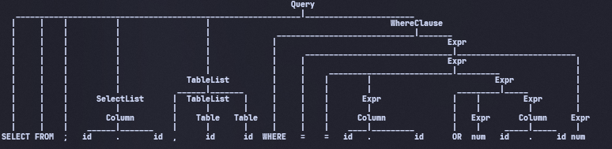
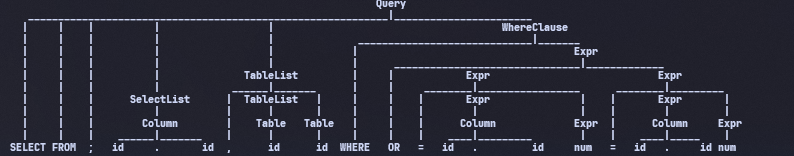
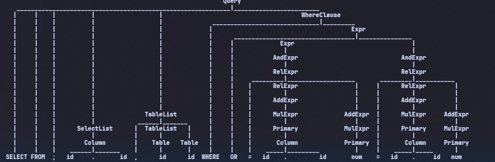
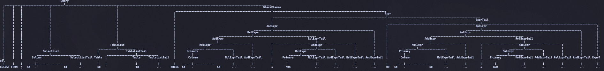
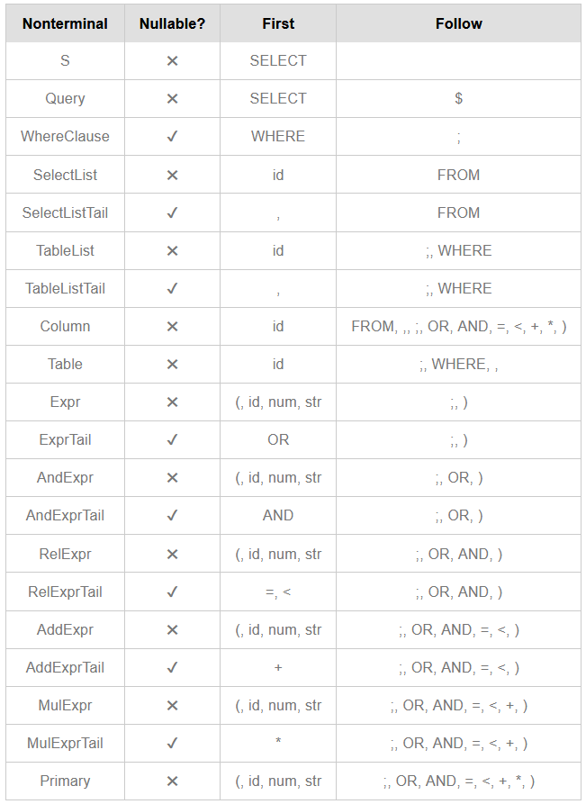
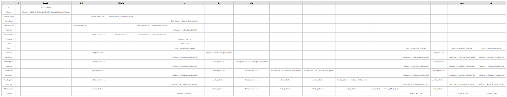
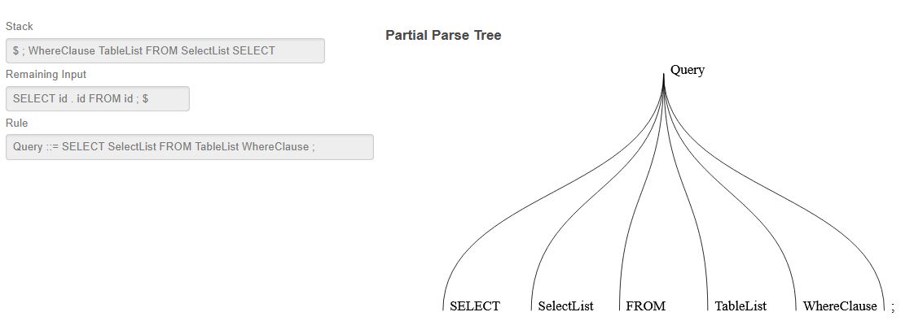
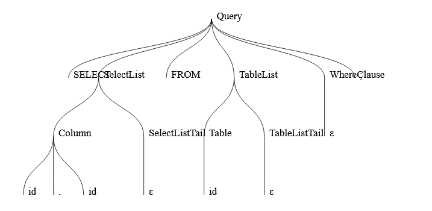
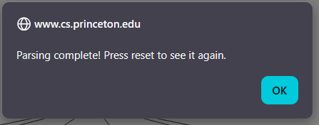
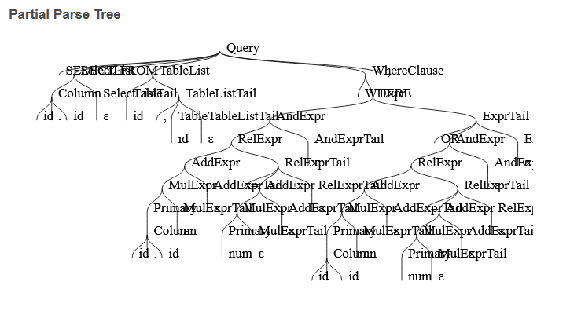

# Evidence: Grammar Generation and Cleaning
## Formal Grammar Design and LL(1) Analysis of a SQL Subset

**Author:** Alexis Yaocalli Berthou Haas 
**Course:** TC2037
**Date:** 28/04/2026

## 1. Introduction

When working with languages such as SQL, one of the main challenges is determining whether a given query is valid. Instead of relying on intuition, this problem can be addressed formally using grammars, which define the structure that valid strings of a language must follow. A grammar provides a set of rules that describe how strings can be constructed. A string is considered valid if it can be derived from a start symbol by applying these rules (Hopcroft et al., 2008). This idea allows us to move from informal validation to a precise and verifiable process.

In this project, the goal is to construct a grammar for a restricted subset of SQL. The process does not begin with a perfect solution. Instead, it starts with a simple grammar that captures the natural structure of queries, even if it contains issues such as ambiguity and left recursion. From this starting point, the grammar is analyzed and transformed step by step. The objective is not only to obtain a working grammar, but to understand how and why each transformation is applied, and how these changes affect parsing.


## 2. SQL Subset

SQL, or Structured Query Language, is a database language used to define, query, and manipulate data in relational database systems. In relational databases, information is organized in tables, and SQL queries allow users to retrieve specific data from those tables through structured clauses such as `SELECT`, `FROM`, and `WHERE` (Silberschatz et al., 2019).

SQL is a useful language for this project because its structure can be represented through grammar rules. A query is not just a random sequence of words. Its clauses must appear in a specific order, and expressions inside conditions must follow syntactic rules. This makes SQL appropriate for analyzing grammar design, ambiguity, left recursion, and parsing. However, SQL is too large to model completely in this project. Real SQL includes many features such as joins, aliases, grouping, ordering, nested queries, aggregate functions, and implementation-specific extensions. Since the objective of this work is to study formal grammar transformation and LL(1) parsing, the language must be restricted to a smaller subset.

The subset modeled in this report follows this general form:

```text
SELECT <select_list> FROM <table_list> [WHERE <expr>] ;
```

This means that every valid query in the subset must include a `SELECT` clause and a `FROM` clause. The `WHERE` clause is optional. Even with this restriction, the subset is expressive enough to include multiple selected columns, multiple source tables, and conditional expressions.

Examples of supported forms are:

```text
SELECT id . id FROM id ;

SELECT id . id , id . id FROM id , id ;

SELECT id . id FROM id WHERE id . id = num ;

SELECT id . id FROM id , id WHERE id . id = num OR id . id = num ;
```

The grammar does not operate directly on raw SQL text. Instead, it works on tokens. This means that concrete table names, column names, numeric values, and string values are abstracted before parsing.

For example, a query such as:

```text
SELECT client . name FROM client ;
```

is represented as:

```text
SELECT id . id FROM id ;
```

In this representation, `id`, `num`, and `str` are terminal symbols. They represent identifiers, numeric literals, and string literals, respectively. This is consistent with the formal definition of a grammar `G = (V, T, P, S)`, where `T` is the set of terminal symbols used to form strings of the language (Hopcroft et al., 2008).

I use this abstraction because the grammar is meant to describe structure, not every possible word that could appear in a database. If I tried to include all table names, column names, numbers, or strings, the grammar would stop being general. It would become a long list of examples. Using `id`, `num`, and `str` keeps the grammar smaller and lets it focus on the form of the query.

### 2.1 Representative Table and Column Model

Even though the grammar uses token categories, the project can still start from realistic SQL-like queries. To show that, I use a small example schema:

| Table | Columns |
| --- | --- |
| `clients` | `id`, `name`, `age`, `city` |
| `orders` | `id`, `client_id`, `total` |

With this schema, a concrete query could be written as:

```sql
SELECT clients.name, orders.total
FROM clients, orders
WHERE clients.id = orders.client_id AND orders.total < 1000;
```

The grammar does not need to store the words `clients`, `orders`, `name`, or `total`. Before parsing, those concrete values are substituted by token categories:

```text
SELECT id . id , id . id FROM id , id WHERE id . id = id . id AND id . id < num ;
```

This keeps the grammar general. The parser checks the shape of the query: selected columns, source tables, operators, and clause order. Then a separate dictionary can check if the table or column names really exist.

This separation is important. Syntax answers: "does the query have the correct form?" The schema dictionary answers: "do these names exist?" Those are related questions, but they are not the same question. Rows are not included for the same reason. A row is data inside a table, not part of the grammar of the query. For example, the value `1000` can be represented as `num`, but the grammar should not store every possible order total or client name.

The supported features are limited to:

- Comma-separated selected columns
- Comma-separated source tables
- Qualified column references of the form `id . id`
- Optional `WHERE` clauses
- Logical operators: `OR`, `AND`
- Relational operators: `=`, `<`
- Arithmetic operators: `+`, `*`
- Parenthesized expressions

The subset intentionally excludes:

- `JOIN`
- `GROUP BY`
- `ORDER BY`
- Aliases
- Nested queries
- Aggregate functions
- Unqualified column references

Column references are written as `id . id` because the grammar treats identifiers as token categories. The first `id` represents a table identifier and the second `id` represents a column identifier. Although this looks more abstract than normal SQL, it keeps the grammar focused on syntactic form. The grammar checks that a qualified reference has the structure identifier-dot-identifier, but it does not verify whether the table or column actually exists. That kind of verification belongs to semantic analysis, not syntax analysis.

Because expressions are part of the language, operator precedence must also be considered. The intended precedence is:

```text
OR < AND < relational (=, <) < + < *
```

The initial grammar `G0` deliberately does not enforce this precedence.

## 3. First Step: Base Grammar G0

### 3.1 Purpose

The first grammar, called `G0`, is intentionally written before any cleaning transformation is applied. Its purpose is to define a meaningful SQL subset while still containing the two problems that must later be removed:

- Direct left recursion
- Ambiguity

So `G0` is not supposed to be perfect. It is the starting grammar that I will clean in the next sections.

### 3.2 Grammar Definition

Formally, a grammar can be described by a tuple containing its variables, terminals, start symbol, and productions (Hopcroft et al., 2008).

```text
G0 = (V, T, P, S)
```

In this notation, `T`, also commonly written as `Σ`, is the set of terminal symbols.

| Symbol | Meaning |
| --- | --- |
| `V` | Set of non-terminals |
| `T` | Set of terminals |
| `P` | Set of productions |
| `S` | Start symbol, with `S = Query` |

### 3.3 Non-Terminals

Non-terminals are grammar symbols that can be expanded by productions during derivation (Hopcroft et al., 2008).

```text
V = { Query, WhereClause, SelectList, TableList, Column, Table, Expr }
```

| Non-terminal | Role |
| --- | --- |
| `Query` | Complete SQL-like query |
| `WhereClause` | Optional conditional part |
| `SelectList` | One or more selected columns |
| `TableList` | One or more source tables |
| `Column` | Qualified column reference |
| `Table` | Table name |
| `Expr` | Conditional or arithmetic expression |

### 3.4 Terminals

Terminals are the symbols that appear in the final strings generated by the grammar (Hopcroft et al., 2008).

```text
T = { SELECT, FROM, WHERE, OR, AND, id, num, str, ., ,, ;, (, ), =, <, +, * }
```

These symbols are terminals because they appear in the final token stream and are not expanded by grammar productions.

The terminals `id`, `num`, and `str` represent token categories produced before parsing. For example, concrete names such as `client` or `name` are represented by `id`, a concrete numeric literal is represented by `num`, and a concrete string literal is represented by `str`.

### 3.5 Productions

```text
Query       → SELECT SelectList FROM TableList WhereClause ;
WhereClause → WHERE Expr | ε
SelectList  → SelectList , Column | Column
TableList   → TableList , Table | Table
Column      → id . id
Table       → id
Expr        → Expr OR Expr | Expr AND Expr | Expr = Expr | Expr < Expr
            | Expr + Expr | Expr * Expr | ( Expr ) | Column | num | str
```

This grammar follows the required SQL scope:

```text
SELECT <select_list> FROM <table_list> [WHERE <expr>] ;
```

Selected columns and column references inside expressions are qualified through `Column → id . id`. Tables are represented by `Table → id`. The grammar includes no joins, aliases, grouping, ordering, or nested queries.

The next section addresses ambiguity first because operator precedence must be established before the recursive expression rules are rewritten. If left recursion were removed first, the grammar would still preserve the same ambiguous structure.

## 4. Ambiguity Analysis in G0

### 4.1 Why G0 Is Ambiguous

The first problem to solve in `G0` is ambiguity. A grammar is ambiguous when at least one string in its language can be generated with more than one parse tree or more than one derivation structure (Linz & Rodger, 2022). In simpler terms, the same input can be understood in more than one syntactic way.

In `G0`, the ambiguity comes from the expression rules:

```text
Expr → Expr OR Expr
Expr → Expr AND Expr
Expr → Expr = Expr
Expr → Expr < Expr
Expr → Expr + Expr
Expr → Expr * Expr
```

The problem is that all operators are introduced through the same non-terminal, `Expr`. Because of this, the grammar does not define precedence. For example, it does not clearly state whether equality expressions should be completed before applying `OR`, or whether `OR` can become part of one side of an equality expression.

### 4.2 NLTK Test for Ambiguity

To test this ambiguity, I implemented `G0` in Python using NLTK's `ChartParser`. A chart parser is useful for this part because it can return all possible parse trees for the same input string. The tested tokenized query was:

```text
SELECT id . id FROM id , id WHERE id . id = num OR id . id = num ;
```

The parser returned 5 parse trees for this single input. This supports the ambiguity analysis of `G0`, because the same terminal sequence was generated with more than one syntactic structure.

The ambiguous part of the query is:

```text
id . id = num OR id . id = num
```

Although this expression is short, it is enough to prove ambiguity. A grammar only needs one string with more than one parse tree to be ambiguous. The NLTK output includes one tree where `OR` is the main operator connecting two equality expressions. It also includes other trees where the outermost operator is `=`, and the `OR` expression appears inside one of its operands.

### 4.3 Representative Parse Trees

**Parse tree 1.** This tree shows one unintended structure, where equality is the outermost operation and the `OR` expression appears inside one equality operand.

```text
(Query
  SELECT
  (SelectList (Column id . id))
  FROM
  (TableList (TableList (Table id)) , (Table id))
  (WhereClause
    WHERE
    (Expr
      (Expr
        (Expr (Column id . id))
        =
        (Expr (Expr num) OR (Expr (Column id . id))))
      =
      (Expr num)))
  ;)
```

Visual tree:



**Parse tree 5.** This tree shows the intended SQL-like structure, where `OR` connects two equality expressions.

```text
(Query
  SELECT
  (SelectList (Column id . id))
  FROM
  (TableList (TableList (Table id)) , (Table id))
  (WhereClause
    WHERE
    (Expr
      (Expr (Expr (Column id . id)) = (Expr num))
      OR
      (Expr (Expr (Column id . id)) = (Expr num))))
  ;)
```

Visual tree:



Both parse trees generate the same tokenized query, but they assign a different syntactic structure to the expression inside `WHERE`. This is why the grammar must be changed before it can be used predictively.

### 4.4 Derivations Showing Ambiguity

A derivation shows how a string is generated by repeatedly applying grammar productions (Hopcroft et al., 2008). Focusing only on the expression, the intended grouping can be represented as:

```text
Expr
→ Expr OR Expr
→ Expr = Expr OR Expr = Expr
→ Column = num OR Column = num
→ id . id = num OR id . id = num
```

A different possible grouping is:

```text
Expr
→ Expr = Expr
→ Column = Expr
→ Column = Expr OR Expr
→ Column = num OR Column = num
→ id . id = num OR id . id = num
```

Both derivations generate the same terminal sequence, but they assign a different structure to the expression. This formally shows the ambiguity.

## 5. Ambiguity Elimination: Grammar G1

### 5.1 Formal Strategy

After proving that `G0` is ambiguous, the next step is to remove the ambiguity without changing the intended language. The issue is that all expression operators are introduced through the same non-terminal, `Expr`. To fix this, the grammar is rewritten so that operator precedence is encoded directly into the grammar. In general, ambiguity is removed by analyzing the source of the multiple parse structures and rewriting the grammar so that only the intended structure remains. 

In this grammar, the source of ambiguity is operator precedence, so the appropriate solution is to separate expressions into precedence levels. Instead of using one non-terminal for every expression operator, the grammar is divided into expression levels. Each level handles a specific group of operators. Operators with lower precedence appear higher in the grammar, while operators with higher precedence appear deeper in the grammar.

The intended precedence is:

```text
OR < AND < relational (=, <) < + < *
```

This means that `*` binds most strongly, followed by `+`, then relational operators, then `AND`, and finally `OR`.

### 5.2 Construction of Precedence Levels

The transformation follows these steps:

1. Keep `Expr` as the highest expression level, responsible for `OR`.
2. Create `AndExpr` for expressions connected by `AND`.
3. Create `RelExpr` for relational comparisons such as `=` and `<`.
4. Create `AddExpr` for addition.
5. Create `MulExpr` for multiplication.
6. Create `Primary` for the smallest expression units: parenthesized expressions, columns, numbers, and strings.

### 5.3 Grammar G1

After applying these steps, the expression part of the grammar becomes `G1`:

```text
Expr     → Expr OR AndExpr | AndExpr
AndExpr  → AndExpr AND RelExpr | RelExpr
RelExpr  → RelExpr = AddExpr | RelExpr < AddExpr | AddExpr
AddExpr  → AddExpr + MulExpr | MulExpr
MulExpr  → MulExpr * Primary | Primary
Primary  → ( Expr ) | Column | num | str
```

The rest of the SQL grammar remains unchanged:

```text
Query       → SELECT SelectList FROM TableList WhereClause ;
WhereClause → WHERE Expr | ε
SelectList  → SelectList , Column | Column
TableList   → TableList , Table | Table
Column      → id . id
Table       → id
```

This transformation removes the ambiguity because operators no longer compete at the same syntactic level. `OR` can only be introduced at the `Expr` level, `AND` at the `AndExpr` level, relational operators at the `RelExpr` level, `+` at the `AddExpr` level, and `*` at the `MulExpr` level.

### 5.4 NLTK Validation of G1

To check the result, I tested the same tokenized query again using the `G1` grammar:

```text
SELECT id . id FROM id , id WHERE id . id = num OR id . id = num ;
```

This time, the parser returned only one parse tree. This supports that the ambiguity demonstrated in `G0` was removed for this expression.

With `G1`, the expression is forced into the intended structure:

```text
( id . id = num ) OR ( id . id = num )
```

The resulting `G1` parse tree is:

```text
(Query
  SELECT
  (SelectList (Column id . id))
  FROM
  (TableList (TableList (Table id)) , (Table id))
  (WhereClause
    WHERE
    (Expr
      (Expr
        (AndExpr
          (RelExpr
            (RelExpr (AddExpr (MulExpr (Primary (Column id . id)))))
            =
            (AddExpr (MulExpr (Primary num))))))
      OR
      (AndExpr
        (RelExpr
          (RelExpr (AddExpr (MulExpr (Primary (Column id . id)))))
          =
          (AddExpr (MulExpr (Primary num)))))))
  ;)
```

Visual tree:



The parser no longer allows `OR` to be grouped as part of one side of the equality expression. This happens because equality is handled deeper in the grammar through `RelExpr`, while `OR` is handled higher through `Expr`.

At this point, `G1` removes the ambiguity shown in `G0`. However, it still contains left recursion, so it is not yet suitable for LL(1) parsing. Therefore, `G1` is useful as an intermediate grammar: it solves ambiguity, but it is not the final parser-ready grammar.

## 6. Left Recursion Analysis in G1

### 6.1 Formal Definition

A production is directly left-recursive when a non-terminal can immediately derive a sentential form that begins with the same non-terminal (Linz & Rodger, 2022). In the standard form, this is written as:

```text
A → Aα | β
```

Here, `A → Aα` is the left-recursive production, while `β` represents an alternative that does not begin with `A`.

### 6.2 Left-Recursive Rules in G1

The grammar `G1` still contains direct left recursion in both list rules and expression rules:

```text
SelectList → SelectList , Column | Column
TableList  → TableList , Table | Table
Expr       → Expr OR AndExpr | AndExpr
AndExpr    → AndExpr AND RelExpr | RelExpr
RelExpr    → RelExpr = AddExpr | RelExpr < AddExpr | AddExpr
AddExpr    → AddExpr + MulExpr | MulExpr
MulExpr    → MulExpr * Primary | Primary
```

Each rule has one alternative that begins with the same non-terminal on the left side. For example, `Expr → Expr OR AndExpr` begins with `Expr`, so it is directly left-recursive.

### 6.3 Why This Matters for LL(1)

An LL(1) parser expands a non-terminal by choosing a production from one lookahead token. This is a problem for top-down parsing because the parser may repeatedly expand the same non-terminal without consuming input, which prevents the parsing process from advancing (Linz & Rodger, 2022). Therefore, the remaining left recursion in `G1` must be removed before the grammar can be used as an LL(1) grammar.

## 7. Left Recursion Elimination: Grammar G2

### 7.1 Formal Transformation

The standard transformation for direct left recursion is:

```text
A  → Aα | β
```

This becomes:

```text
A  → β A'
A' → α A' | ε
```

This is the standard transformation used to remove direct left recursion from a grammar before top-down parsing (Linz & Rodger, 2022).

The new helper non-terminal `A'` stores the repetition that was previously expressed through left recursion.

This transformation preserves the same repeated structure, but changes where the repetition appears. Instead of beginning with the recursive call, the grammar first generates the base case `β` and then uses `A'` to decide whether the repeated pattern `α` should continue.

### 7.2 Step-by-Step Application

For example, in the production:

```text
SelectList → SelectList , Column | Column
```

the components of the general form `A → Aα | β` are:

```text
A = SelectList
α = , Column
β = Column
```

Applying the transformation gives:

```text
SelectList     → Column SelectListTail
SelectListTail → , Column SelectListTail | ε
```

Applying the same pattern to `TableList` gives:

```text
TableList     → Table TableListTail
TableListTail → , Table TableListTail | ε
```

For the expression rules, the same method can be shown with `Expr`:

```text
Expr → Expr OR AndExpr | AndExpr
```

The components are:

```text
A = Expr
α = OR AndExpr
β = AndExpr
```

Applying the transformation gives:

```text
Expr     → AndExpr ExprTail
ExprTail → OR AndExpr ExprTail | ε
```

The same pattern is then applied to the remaining expression levels, where each recursive operator part is moved into a tail non-terminal:

```text
AndExpr     → RelExpr AndExprTail
AndExprTail → AND RelExpr AndExprTail | ε

RelExpr     → AddExpr RelExprTail
RelExprTail → = AddExpr RelExprTail | < AddExpr RelExprTail | ε

AddExpr     → MulExpr AddExprTail
AddExprTail → + MulExpr AddExprTail | ε

MulExpr     → Primary MulExprTail
MulExprTail → * Primary MulExprTail | ε
```

### 7.3 Grammar G2

After removing direct left recursion, the grammar becomes `G2`:

```text
Query       → SELECT SelectList FROM TableList WhereClause ;
WhereClause → WHERE Expr | ε

SelectList     → Column SelectListTail
SelectListTail → , Column SelectListTail | ε

TableList     → Table TableListTail
TableListTail → , Table TableListTail | ε

Column → id . id
Table  → id

Expr     → AndExpr ExprTail
ExprTail → OR AndExpr ExprTail | ε

AndExpr     → RelExpr AndExprTail
AndExprTail → AND RelExpr AndExprTail | ε

RelExpr     → AddExpr RelExprTail
RelExprTail → = AddExpr RelExprTail | < AddExpr RelExprTail | ε

AddExpr     → MulExpr AddExprTail
AddExprTail → + MulExpr AddExprTail | ε

MulExpr     → Primary MulExprTail
MulExprTail → * Primary MulExprTail | ε

Primary → ( Expr ) | Column | num | str
```

This grammar preserves the intended precedence structure from `G1`, but it no longer uses direct left recursion. Therefore, `G2` is the version prepared for LL(1) validation.

At this stage, the grammar has removed the direct left recursion identified in `G1`. The next section must still verify the LL(1) condition through FIRST and FOLLOW sets.

## 8. Syntax Tree Comparison After Transformations

The syntax trees show how the grammar changes after each transformation.

In `G0`, the tested query produced 5 parse trees, which supports the ambiguity analysis. Two representative trees were shown in Section 4.3: one unintended structure where `=` becomes the outermost operator, and one intended structure where `OR` connects two equality expressions.

In `G1`, the same query produced only one parse tree. This shows that introducing precedence levels removed the ambiguity.

In `G2`, the same query also produced one parse tree. The structure is wider because left-recursion elimination introduces helper non-terminals such as `ExprTail`, `RelExprTail`, and `TableListTail`. These helper rules do not change the intended meaning of the query; they only make the grammar suitable for LL(1) parsing.

The progression is:

```text
G0 → ambiguous and left-recursive
G1 → ambiguity removed, still left-recursive
G2 → ambiguity removed and left recursion removed
```

The following `G2` parse tree is included as NLTK output evidence. Its structure is wider because helper tail non-terminals are now explicit.

```text
(Query
  SELECT
  (SelectList (Column id . id) (SelectListTail ))
  FROM
  (TableList
    (Table id)
    (TableListTail , (Table id) (TableListTail )))
  (WhereClause
    WHERE
    (Expr
      (AndExpr
        (RelExpr
          (AddExpr
            (MulExpr (Primary (Column id . id)) (MulExprTail ))
            (AddExprTail ))
          (RelExprTail
            =
            (AddExpr
              (MulExpr (Primary num) (MulExprTail ))
              (AddExprTail ))
            (RelExprTail )))
        (AndExprTail ))
      (ExprTail
        OR
        (AndExpr
          (RelExpr
            (AddExpr
              (MulExpr (Primary (Column id . id)) (MulExprTail ))
              (AddExprTail ))
            (RelExprTail
              =
              (AddExpr
                (MulExpr (Primary num) (MulExprTail ))
                (AddExprTail ))
              (RelExprTail )))
          (AndExprTail ))
        (ExprTail ))))
  ;)
```

Visual tree:



These NLTK results provide implementation evidence that the grammars parse the selected string as expected. The formal LL(1) validation is performed later through FIRST sets, FOLLOW sets, and the parsing table.

## 9. Final Grammar G2

After removing ambiguity and direct left recursion, the final grammar is called `G2`. It still represents the same SQL subset, but now it is written in a way that can be checked as LL(1).

I repeat it here because this is the exact version used in the Python tests and in the LL(1) validation.

```text
Query       → SELECT SelectList FROM TableList WhereClause ;
WhereClause → WHERE Expr | ε

SelectList     → Column SelectListTail
SelectListTail → , Column SelectListTail | ε

TableList     → Table TableListTail
TableListTail → , Table TableListTail | ε

Column → id . id
Table  → id

Expr     → AndExpr ExprTail
ExprTail → OR AndExpr ExprTail | ε

AndExpr     → RelExpr AndExprTail
AndExprTail → AND RelExpr AndExprTail | ε

RelExpr     → AddExpr RelExprTail
RelExprTail → = AddExpr RelExprTail | < AddExpr RelExprTail | ε

AddExpr     → MulExpr AddExprTail
AddExprTail → + MulExpr AddExprTail | ε

MulExpr     → Primary MulExprTail
MulExprTail → * Primary MulExprTail | ε

Primary → ( Expr ) | Column | num | str
```

This grammar is the version used for the NLTK implementation tests and the LL(1) parser validation.

## 10. Implementation Tests with NLTK

The Python scripts are used to check that the grammars behave as explained in the report. Most tests use tokenized input directly, because that is what the grammar reads. I also added one script with concrete SQL-like queries, so it is clearer how a normal-looking query becomes grammar input.

These scripts are evidence that the grammars accept and reject the examples I expect. They do not replace the LL(1) analysis, because NLTK can parse context-free grammars even when they are not LL(1).

### 10.1 Script Organization

All Python files are stored in the `scripts/` folder:

| Script | Purpose | How to run |
| --- | --- | --- |
| `scripts/g0_tree.py` | Parses one sentence with the ambiguous grammar `G0` and prints all parse trees. | `python scripts/g0_tree.py "SELECT id . id FROM id , id WHERE id . id = num OR id . id = num ;"` |
| `scripts/g1_tree.py` | Parses one sentence with `G1`, after ambiguity removal. | `python scripts/g1_tree.py "SELECT id . id FROM id , id WHERE id . id = num OR id . id = num ;"` |
| `scripts/g2_tree.py` | Parses one sentence with `G2`, after left recursion removal. | `python scripts/g2_tree.py "SELECT id . id FROM id , id WHERE id . id = num OR id . id = num ;"` |
| `scripts/run_tree.py` | Calls one of the tree scripts for the common comparison sentence. | `python scripts/run_tree.py g0`, `python scripts/run_tree.py g1`, or `python scripts/run_tree.py g2` |
| `scripts/g_final_tests.py` | Runs the final accepted and rejected test suite for `G2`, or checks one custom input string. | `python scripts/g_final_tests.py` |
| `scripts/concrete_query_tests.py` | Converts concrete SQL-like queries into grammar tokens and optionally checks them against a small schema dictionary. | `python scripts/concrete_query_tests.py` |

### 10.2 Running the Scripts on Windows and Linux/macOS

Run these commands from the main folder of the project, the same folder where this `README.md` file is located. Do not enter the `scripts/` folder before running them.

The scripts use Python and NLTK. If NLTK is not installed, install it first:

On Windows PowerShell:

```powershell
python -m pip install nltk
```

On Linux or macOS:

```bash
python3 -m pip install nltk
```

The main tests are:

Windows PowerShell:

```powershell
python scripts\g_final_tests.py
python scripts\concrete_query_tests.py
python scripts\run_tree.py g0
python scripts\run_tree.py g1
python scripts\run_tree.py g2
```

Linux or macOS:

```bash
python3 scripts/g_final_tests.py
python3 scripts/concrete_query_tests.py
python3 scripts/run_tree.py g0
python3 scripts/run_tree.py g1
python3 scripts/run_tree.py g2
```

If your Windows installation uses the `py` launcher, the same commands also work by replacing `python` with `py`. The most important commands are `g_final_tests.py` for the final grammar and `concrete_query_tests.py` for the concrete-query examples.

### 10.3 Running the Provided Test Suite

To run all accepted and rejected tests for the final grammar, use:

```powershell
python scripts\g_final_tests.py
```

On Linux or macOS, the equivalent command is:

```bash
python3 scripts/g_final_tests.py
```

With no arguments, the script runs the built-in test suite. For each input, it prints the expected result, the actual result, the number of parse trees, and whether the test passed. If any test fails, the program exits with an error code.

### 10.4 Testing a Custom String

To test a custom tokenized SQL string with the final grammar `G2`, pass the string as an argument.

Windows:

```powershell
python scripts\g_final_tests.py "SELECT id . id FROM id WHERE id . id = num ;"
```

Linux or macOS:

```bash
python3 scripts/g_final_tests.py "SELECT id . id FROM id WHERE id . id = num ;"
```

The custom mode prints the input, whether `G2` accepts or rejects it, and the number of parse trees. This is useful for testing additional examples without editing the script.

The concrete-query script can also receive a realistic SQL-like string. In that case, it first prints the tokenized version and then reports both checks: syntax according to `G2`, and schema validity according to the small dictionary.

Windows:

```powershell
python scripts\concrete_query_tests.py "SELECT clients.name FROM clients WHERE clients.age < 30;"
```

Linux or macOS:

```bash
python3 scripts/concrete_query_tests.py "SELECT clients.name FROM clients WHERE clients.age < 30;"
```

The tree scripts also accept custom strings. They are useful when the parse tree itself is needed.

Windows:

```powershell
python scripts\g2_tree.py "SELECT id . id FROM id WHERE id . id = num ;"
```

Linux or macOS:

```bash
python3 scripts/g2_tree.py "SELECT id . id FROM id WHERE id . id = num ;"
```

### 10.5 Lexical, Syntax, and Schema Validation

The implementation separates three checks because they answer different questions.

The lexical or substitution step asks: "what kind of token is this?" It recognizes concrete names, numbers, string literals, and punctuation. In this project the step is intentionally small. Names such as `clients` and `name` become `id`, numeric values such as `1000` become `num`, and quoted values such as `'Monterrey'` become `str`.

The syntax step asks: "does the token stream follow the grammar?" This is where `G2` is used. For example, it checks that selected columns have the form `id . id`, that the query contains the required `SELECT` and `FROM` clauses, and that a `WHERE` clause has a valid expression.

The schema step asks: "do the concrete names exist in the example database model?" This happens after parsing and uses a small dictionary. The dictionary can reject `clients.email` because `email` is not listed as a column, but that does not make the grammar wrong. It only means the concrete query fails the optional semantic check.

### 10.6 Testing Concrete Queries

The script `scripts/concrete_query_tests.py` shows the small bridge between real-looking input and the grammar. It is not a full SQL lexer or a database engine. It only does the substitutions needed for this project.

The script separates punctuation such as `.`, `,`, `;`, `=`, and `<`. It keeps SQL keywords such as `SELECT`, `FROM`, `WHERE`, `AND`, and `OR`. Then it changes real names into `id`, numbers into `num`, and quoted text into `str`. The result is sent to the final grammar `G2`.

For example:

```sql
SELECT clients.name, orders.total FROM clients, orders WHERE clients.id = orders.client_id AND orders.total < 1000;
```

is converted into:

```text
SELECT id . id , id . id FROM id , id WHERE id . id = id . id AND id . id < num ;
```

The same script also includes a small schema dictionary:

```text
clients: age, city, id, name
orders: client_id, id, total
```

This dictionary is not part of the grammar. It is included to show how the project could be extended after syntactic parsing, without changing the formal grammar itself.

For instance, the concrete query `SELECT clients.email FROM clients ;` becomes:

```text
SELECT id . id FROM id ;
```

The grammar accepts that token stream because the structure is valid. The dictionary rejects the concrete query because `email` is not listed as a column of `clients`.

This is why the final grammar does not contain every possible column or row. If all concrete names were part of the grammar, then a different database would need a different grammar. In this project, the grammar stays the same and only the example dictionary changes.

This creates a clear workflow:

```text
Concrete query -> tokenized query -> grammar parser -> optional schema dictionary check
```

The main focus remains the grammar. The substitution step only makes it easier to test multiple realistic cases without rewriting the grammar for each possible table name, column name, number, or string.

### 10.7 Test Cases Used in the Report

| Test string | Expected result | Explanation |
| --- | --- | --- |
| `SELECT id . id FROM id ;` | Accepted | Matches the basic `SELECT SelectList FROM TableList WhereClause ;` structure with an empty `WhereClause`. |
| `SELECT id . id , id . id FROM id ;` | Accepted | The selected columns are valid because `SelectListTail` allows comma-separated columns. |
| `SELECT id . id FROM id , id ;` | Accepted | The table list is valid because `TableListTail` allows comma-separated tables. |
| `SELECT id . id FROM id WHERE id . id = num ;` | Accepted | The `WHERE` clause contains a valid relational expression. |
| `SELECT id . id FROM id , id WHERE id . id = num OR id . id = num ;` | Accepted | The expression uses `OR` through `ExprTail`. |
| `SELECT id . id , id . id FROM id , id WHERE id . id = id . id AND id . id < num ;` | Accepted | Represents a realistic query with two selected columns, two tables, a column-to-column comparison, and a numeric comparison. |
| `SELECT id . id FROM id WHERE id . id + num * num < num ;` | Accepted | The expression follows arithmetic and relational precedence through `AddExpr`, `MulExpr`, and `RelExpr`. |
| `SELECT id . id FROM id WHERE ( id . id = num ) AND id . id = str ;` | Accepted | Parentheses and `AND` are valid through `Primary` and `AndExprTail`. |
| `SELECT FROM id ;` | Rejected | The query is missing a valid `SelectList`. |
| `SELECT id . id id ;` | Rejected | The required `FROM` keyword is missing. |
| `SELECT id . id FROM ;` | Rejected | The query is missing a valid `TableList`. |
| `SELECT id . id FROM id WHERE ;` | Rejected | The `WHERE` keyword is present but no expression follows it. |
| `SELECT id . id FROM id WHERE id . id = ;` | Rejected | The relational operator is missing a right-hand expression. |
| `SELECT id FROM id ;` | Rejected | Column references must follow the qualified form `id . id`. |
| `SELECT id . id FROM id WHERE id = num ;` | Rejected | Column references inside expressions must also use the qualified form `id . id`. |

For the final grammar, the accepted strings should produce one parse tree. The rejected strings should produce zero parse trees.

When I ran `python scripts/g_final_tests.py`, all 15 tests passed. The 8 accepted strings produced one parse tree each, and the 7 rejected strings produced zero parse trees.

These tests only check syntax. They do not check if a real table or column exists. That second idea is shown separately in `scripts/concrete_query_tests.py`.

A sample of the execution output is shown below:

```text
Input: SELECT id . id FROM id ;
Expected: ACCEPT
Actual: ACCEPT
Parse trees: 1
Result: PASS
------------------------------------------------------------
Input: SELECT FROM id ;
Expected: REJECT
Actual: REJECT
Parse trees: 0
Result: PASS
------------------------------------------------------------
```

The full terminal output is included in Appendix A.

## 11. LL(1) Validation with Princeton Parser Tool

The final grammar `G2` is validated with the Princeton LL(1) Parser Tool:

```text
https://www.cs.princeton.edu/courses/archive/spring20/cos320/LL1/
```

The tool requires each production to be written on a separate line, tokens to be separated by whitespace, and the empty string to be written as `''`. A grammar is LL(1) for this tool when the generated parsing table has no conflicts.

An LL(1) parser reads the input from left to right, constructs a leftmost derivation, and uses one lookahead token to choose which production to apply. Therefore, the grammar is LL(1) only if each parsing-table cell contains at most one production. If a cell contains more than one production, the parser would not know which rule to choose.

For the required test documentation, this report uses LL(1) parser analysis instead of pushdown automata. The Princeton tool provides the FIRST sets, FOLLOW sets, parsing table, and parsing steps used to justify the accepted strings.

The grammar entered into the Princeton tool is:

```text
Query ::= SELECT SelectList FROM TableList WhereClause ;

WhereClause ::= WHERE Expr
WhereClause ::= ''

SelectList ::= Column SelectListTail
SelectListTail ::= , Column SelectListTail
SelectListTail ::= ''

TableList ::= Table TableListTail
TableListTail ::= , Table TableListTail
TableListTail ::= ''

Column ::= id . id
Table ::= id

Expr ::= AndExpr ExprTail
ExprTail ::= OR AndExpr ExprTail
ExprTail ::= ''

AndExpr ::= RelExpr AndExprTail
AndExprTail ::= AND RelExpr AndExprTail
AndExprTail ::= ''

RelExpr ::= AddExpr RelExprTail
RelExprTail ::= = AddExpr RelExprTail
RelExprTail ::= < AddExpr RelExprTail
RelExprTail ::= ''

AddExpr ::= MulExpr AddExprTail
AddExprTail ::= + MulExpr AddExprTail
AddExprTail ::= ''

MulExpr ::= Primary MulExprTail
MulExprTail ::= * Primary MulExprTail
MulExprTail ::= ''

Primary ::= ( Expr )
Primary ::= Column
Primary ::= num
Primary ::= str
```

The first token stream entered into the Princeton tool is:

```text
SELECT id . id FROM id ;
```

The second token stream entered into the Princeton tool is:

```text
SELECT id . id FROM id , id WHERE id . id = num OR id . id = num ;
```

### 11.1 FIRST, FOLLOW, and Nullable Evidence

FIRST sets indicate which terminal symbols can appear at the beginning of strings derived from a non-terminal. FOLLOW sets indicate which terminal symbols can appear immediately to the right of a non-terminal in a sentential form. The Nullable column indicates whether a non-terminal can derive the empty string.

The Princeton tool generated the following FIRST, FOLLOW, and Nullable table for `G2`:



### 11.2 Parsing Table Evidence

The Princeton tool also generated the LL(1) parsing table:



The relevant result is that no cell in the parsing table contains more than one production. Since the generated parsing table has no conflicting cells, `G2` satisfies the LL(1) condition for the grammar entered into the tool. The test strings demonstrate how the LL(1) parser applies the table to concrete inputs.

### 11.3 Parsing Process Evidence

To show the parsing process, a token stream was entered into the tool. The tool then displayed the stack, the remaining input, and the production applied at each step.

For the first token stream:

```text
SELECT id . id FROM id ;
```

the parsing process begins by expanding `Query` into the required `SELECT`, `SelectList`, `FROM`, `TableList`, `WhereClause`, and `;` structure:



The first token stream was accepted by the LL(1) parser. The parser successfully expanded `Query`, matched the required `SELECT`, `FROM`, and `;` terminals, and used the empty production for `WhereClause`, confirming that queries without a `WHERE` clause are accepted.





For the second token stream:

```text
SELECT id . id FROM id , id WHERE id . id = num OR id . id = num ;
```
The parser produced the following parse tree:



The parse tree becomes a bit hard to read because the grammar is wider after left recursion elimination, but it still shows the intended structure. The `SELECT` clause contains one column, and the `FROM` clause contains two tables. The `WHERE` clause contains an `OR` expression that connects two equality expressions. 

The second token stream was also accepted. The parser used `TableListTail` to process the second table and `ExprTail` to process the `OR` expression inside the `WHERE` clause.

These tool results support the predictive parsing behavior of `G2`. They provide concrete evidence that the generated FIRST sets, FOLLOW sets, parsing table, and parsing steps are consistent with the intended LL(1) behavior.

## 12. Chomsky Hierarchy Classification

The grammars discussed in this report are Type 2 grammars in the Chomsky hierarchy. Type 2 grammars are also known as context-free grammars. In this kind of grammar, each rule has a single non-terminal symbol on the left side, which is then replaced by other symbols according to the grammar’s rules (Hopcroft et al., 2008).

### 12.1 Classification of G0

The initial grammar `G0` is Type 2 because every production has one non-terminal on the left-hand side. For example:

```text
Query       → SELECT SelectList FROM TableList WhereClause ;
SelectList  → SelectList , Column | Column
Expr        → Expr OR Expr | Column | num | str
```

Even though `G0` is ambiguous and left-recursive, those properties do not change its Chomsky classification. Ambiguity means that a string can have more than one parse tree, and left recursion affects top-down parsing, but neither issue changes the formal shape of the productions. The left-hand side of each rule is still a single non-terminal.

### 12.2 Classification of G2

The final grammar `G2` is also Type 2. The transformations introduced new non-terminals such as `ExprTail`, `RelExprTail`, and `TableListTail`, but every production still has a single non-terminal on the left-hand side:

```text
Expr     → AndExpr ExprTail
ExprTail → OR AndExpr ExprTail | ε
RelExpr  → AddExpr RelExprTail
Primary  → ( Expr ) | Column | num | str
```

Therefore, the transformations from `G0` to `G2` changed the parsing properties of the grammar, but they did not change its position in the Chomsky hierarchy. Both grammars are context-free.

## 13. Complexity Analysis

The final grammar `G2` is the only grammar analyzed in this section. The earlier grammars are useful for showing the transformation process, but the implemented result is `G2`, so the complexity analysis should focus on how this final grammar is processed by the tools used in the project.

Parsing complexity depends on the parsing algorithm, not only on the grammar. In this project there are two relevant tools:

| Tool | Role in the project | What it means for complexity |
| --- | --- | --- |
| NLTK `ChartParser` | Used by the Python scripts to test accepted and rejected strings. | It is a general chart parser, so its behavior is broader than an LL(1) parser. |
| Princeton LL(1) Parser Tool | Used to validate FIRST sets, FOLLOW sets, and the LL(1) parsing table. | It represents the predictive parsing behavior intended for the final grammar. |

### 13.1 NLTK ChartParser

The Python tests use NLTK's `ChartParser`. According to the NLTK documentation, chart parsers use dynamic programming, store partial parsing hypotheses as chart edges, and keep adding edges until no new edges can be added (NLTK Project, 2026). The documentation also explains that `ChartParser` returns complete parses from the chart.

This is useful for the project because the same tool can parse `G0`, `G1`, and `G2`, including the ambiguous first grammar. However, it also means that NLTK is not the final complexity model for `G2`. A chart parser is a general context-free parsing tool. It can represent multiple possible parses, and when a script asks for all parse trees, the output cost also depends on how many trees are generated.

For the final grammar tests, every accepted string produces exactly one parse tree. In practice, the test cases are small and deterministic. Still, the role of NLTK in this project is evidence and experimentation, not the formal claim that the parser runs as an LL(1) compiler.

### 13.2 LL(1) Parsing of G2

The final grammar `G2` was designed to be LL(1). The Princeton tool checks this by computing nullable, FIRST, and FOLLOW information and then generating the LL(1) transition table (Princeton COS 320, 2020). The important result is that the table has no conflicting cells.

Once the grammar has a conflict-free LL(1) table, parsing is deterministic. At each step, the parser only needs:

1. the non-terminal on top of the stack,
2. the next input token,
3. one table lookup to choose the production.

For an input with `n` tokens, the parser reads the input from left to right. Each terminal match consumes one input token. Non-terminal expansions add grammar symbols to the stack, but `G2` has a fixed number of productions and fixed maximum production length. Therefore, the number of parser actions grows linearly with the number of input tokens.

The time complexity of parsing `G2` with an LL(1) predictive parser is:

```text
O(n)
```

where `n` is the number of tokens in the tokenized query.

The space complexity is also linear in the size of the input in the normal predictive-parsing model:

```text
O(n)
```

This space is mainly used by the parser stack and the input stream. The parsing table itself is constant for this project because the grammar does not change while parsing a query.

### 13.3 Token Substitution and Dictionary Check

The concrete-query script adds two simple steps before and after grammar parsing.

Before parsing, it substitutes concrete words and numbers into grammar tokens. This step scans the query once and produces a token stream, so it is linear:

```text
O(n)
```

After parsing, the optional schema dictionary check verifies that referenced tables and columns exist in the example schema. Dictionary and set lookups are treated as constant-time operations on average, so this step is also linear in the number of tokens or references checked.

The complete practical workflow is therefore:

```text
token substitution: O(n)
LL(1) parsing:      O(n)
dictionary check:   O(n)
```

Taken together, the workflow remains linear with respect to the length of the input query:

```text
O(n)
```

This conclusion applies to the final grammar and the intended LL(1) parsing model. The NLTK chart parser remains useful for testing, but the formal complexity claim for the final parser is based on the LL(1) table-driven behavior validated with the Princeton tool.

## 14. Conclusion

This project helped me understand context-free grammars in a more practical way, not only as a set of definitions. At the beginning, designing the SQL subset was not the hardest part, because the basic structure of the language was already clear: a query needs `SELECT`, `FROM`, and optionally `WHERE`. The first grammar `G0` was useful because it followed that natural structure, but it also showed why a grammar that looks reasonable at first can still have important problems. In this case, the problems were ambiguity and left recursion. Seeing the same expression produce more than one parse tree made the idea of ambiguity much clearer than only reading the definition, because the problem was no longer abstract. It was visible in the output of the parser.

The most interesting part of the process was cleaning the grammar. Removing ambiguity required planning the expression rules by precedence, instead of leaving every operator at the same level. This produced `G1`, where `OR`, `AND`, relational operators, addition, multiplication, and primary expressions each had their own place in the grammar. After that, the remaining left recursion had to be removed to make the grammar appropriate for LL(1) parsing, which produced `G2`. This part made me understand that cleaning a grammar is not just a mechanical step. Each change affects how a parser will read the input, and a small decision in the grammar can completely change the parse tree. Reading about FIRST sets, FOLLOW sets, parsing tables, and NLTK helped, but implementing the grammars and fixing mistakes over time made the concepts easier to understand.

Another important part of the project was connecting the formal grammar with more realistic SQL-like examples. The grammar works with tokens such as `id`, `num`, and `str`, so by itself it does not know names like `clients`, `orders`, or `total`. At first this can make the grammar look less realistic, but the concrete-query script helped solve that problem without changing the formal grammar. The script performs a small lexical substitution step, then the grammar checks the tokenized query, and finally the optional schema dictionary checks whether the real table and column names exist. I liked this separation because it made the project feel closer to a real language-processing workflow while still keeping the grammar focused on syntax. In the end, `G0` and `G2` remain Type 2 context-free grammars in the Chomsky hierarchy, but their parsing behavior is very different. The final result is not a bigger language; it is a clearer and more useful version of the same intended SQL subset, supported by automated NLTK tests and by the LL(1) evidence from the Princeton tool.

## Appendix A. NLTK Test Output

The complete output of `python scripts/g_final_tests.py` is:

```text
Input: SELECT id . id FROM id ;
Expected: ACCEPT
Actual: ACCEPT
Parse trees: 1
Result: PASS
------------------------------------------------------------
Input: SELECT id . id , id . id FROM id ;
Expected: ACCEPT
Actual: ACCEPT
Parse trees: 1
Result: PASS
------------------------------------------------------------
Input: SELECT id . id FROM id , id ;
Expected: ACCEPT
Actual: ACCEPT
Parse trees: 1
Result: PASS
------------------------------------------------------------
Input: SELECT id . id FROM id WHERE id . id = num ;
Expected: ACCEPT
Actual: ACCEPT
Parse trees: 1
Result: PASS
------------------------------------------------------------
Input: SELECT id . id FROM id , id WHERE id . id = num OR id . id = num ;
Expected: ACCEPT
Actual: ACCEPT
Parse trees: 1
Result: PASS
------------------------------------------------------------
Input: SELECT id . id , id . id FROM id , id WHERE id . id = id . id AND id . id < num ;
Expected: ACCEPT
Actual: ACCEPT
Parse trees: 1
Result: PASS
------------------------------------------------------------
Input: SELECT id . id FROM id WHERE id . id + num * num < num ;
Expected: ACCEPT
Actual: ACCEPT
Parse trees: 1
Result: PASS
------------------------------------------------------------
Input: SELECT id . id FROM id WHERE ( id . id = num ) AND id . id = str ;
Expected: ACCEPT
Actual: ACCEPT
Parse trees: 1
Result: PASS
------------------------------------------------------------
Input: SELECT FROM id ;
Expected: REJECT
Actual: REJECT
Parse trees: 0
Result: PASS
------------------------------------------------------------
Input: SELECT id . id id ;
Expected: REJECT
Actual: REJECT
Parse trees: 0
Result: PASS
------------------------------------------------------------
Input: SELECT id . id FROM ;
Expected: REJECT
Actual: REJECT
Parse trees: 0
Result: PASS
------------------------------------------------------------
Input: SELECT id . id FROM id WHERE ;
Expected: REJECT
Actual: REJECT
Parse trees: 0
Result: PASS
------------------------------------------------------------
Input: SELECT id . id FROM id WHERE id . id = ;
Expected: REJECT
Actual: REJECT
Parse trees: 0
Result: PASS
------------------------------------------------------------
Input: SELECT id FROM id ;
Expected: REJECT
Actual: REJECT
Parse trees: 0
Result: PASS
------------------------------------------------------------
Input: SELECT id . id FROM id WHERE id = num ;
Expected: REJECT
Actual: REJECT
Parse trees: 0
Result: PASS
------------------------------------------------------------
```

## Appendix B. Concrete Query Substitution Output

The complete output of `python scripts/concrete_query_tests.py` is:

```text
Schema dictionary:
  clients: age, city, id, name
  orders: client_id, id, total

Concrete input: SELECT clients.name, orders.total FROM clients, orders WHERE clients.id = orders.client_id AND orders.total < 1000;
Tokenized input: SELECT id . id , id . id FROM id , id WHERE id . id = id . id AND id . id < num ;
Syntax: ACCEPT
Schema dictionary: ACCEPT
Parse trees: 1
Result: PASS
------------------------------------------------------------
Concrete input: SELECT clients.name FROM clients WHERE clients.age < 30;
Tokenized input: SELECT id . id FROM id WHERE id . id < num ;
Syntax: ACCEPT
Schema dictionary: ACCEPT
Parse trees: 1
Result: PASS
------------------------------------------------------------
Concrete input: SELECT clients.name FROM clients WHERE clients.city = 'Monterrey';
Tokenized input: SELECT id . id FROM id WHERE id . id = str ;
Syntax: ACCEPT
Schema dictionary: ACCEPT
Parse trees: 1
Result: PASS
------------------------------------------------------------
Concrete input: SELECT clients.email FROM clients;
Tokenized input: SELECT id . id FROM id ;
Syntax: ACCEPT
Schema dictionary: REJECT
Parse trees: 1
Result: PASS
------------------------------------------------------------
Concrete input: SELECT clients FROM clients;
Tokenized input: SELECT id FROM id ;
Syntax: REJECT
Schema dictionary: REJECT
Parse trees: 0
Result: PASS
------------------------------------------------------------
```

## Use of AI in the Project

AI was used as a support tool during this project, mainly to review wording, organize explanations, and check that the README matched the Python scripts and test results. It was also useful for finding small inconsistencies in the code comments and for making the run instructions clearer for Windows and Linux/macOS.

The grammar design, the SQL subset, the transformation from `G0` to `G2`, the interpretation of the tests, and the final decisions about what to include in the project were my responsibility. I used AI to help polish and verify the work, but not as a replacement for the design of the grammar or the LL(1) analysis.

## References

Hopcroft, J. E., Motwani, R., & Ullman, J. D. (2008). *Introduction to automata theory, languages, and computation* (3rd ed.). Pearson.

Linz, P., & Rodger, S. H. (2022). *An introduction to formal languages and automata*. Jones & Bartlett Learning.

NLTK Project. (2026). *nltk.parse.chart module*. https://www.nltk.org/api/nltk.parse.chart.html

Princeton COS 320. (2020). *LL(1) Parser Visualization*. https://www.cs.princeton.edu/courses/archive/spring20/cos320/LL1/

Silberschatz, A., Korth, H. F., & Sudarshan, S. (2019). *Database system concepts* (7th ed.). McGraw-Hill Education.
